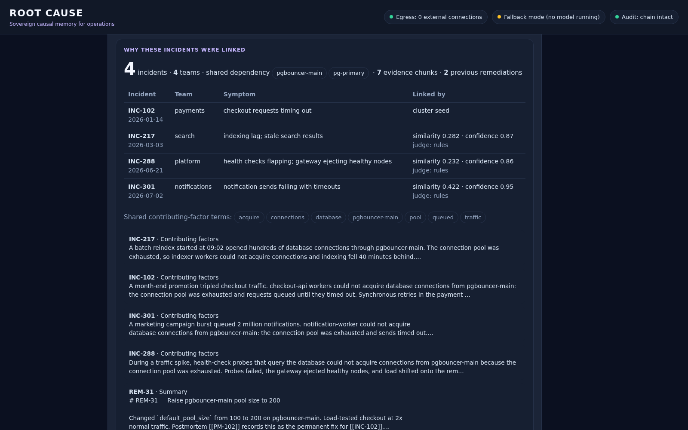

# Root Cause

**Sovereign causal memory for operations.**

Root Cause reads an organisation's incident reports, tickets and postmortems, works out which
failures keep coming back for the same underlying reason, proves whether the last fix actually
worked, and warns you *before* someone ships the same change again.

It runs entirely on one laptop. Local open-weight models, no internet, no API keys.

> Existing tools already record incidents. Root Cause connects the incidents those tools keep
> treating as separate — and uses that memory before the next decision.

**ASYNC'26 · Track 1: Sovereign AI · Team Track and Field** — Ramaiah Institute of Technology



---

## What it does

| | |
|---|---|
| **Recurrence clusters** | Links incidents from different teams that share an underlying cause — here, a checkout outage, a search indexing lag, a gateway health-check storm and a notification failure, all tracing back to one exhausted connection pool. |
| **Fix effectiveness** | A remediation recorded as a "permanent fix" is marked **ineffective** when the same cluster recurs after it. Pure timestamp comparison — it cannot hallucinate. |
| **Failure debt** | Recurrence × persistence × impact × cross-team spread, ranked. Deterministic: the model does not decide how much debt exists. |
| **Pre-flight check** | Paste a change plan. If it touches a component owned by a recurrence cluster, you get a warning with the incidents and the fixes that didn't hold. |
| **Cited answers** | Ask a question; every claim links to the chunk it came from. Out-of-scope questions get an honest *"Nothing in the record covers that."* |
| **Prompt-injection quarantine** | Retrieved content is evidence, not authority. Documents that try to instruct the agent are quarantined before they reach a prompt. |
| **Policy gate + MCP** | The model may propose actions; a fixed policy table decides AUTO / APPROVAL / BLOCK. The same gate applies to agents connected over MCP. |
| **Audit ledger** | Every event is hash-chained. Edit any entry and the chain visibly breaks. |
| **Obsidian vault** | The corpus is a plain markdown vault. Approved cluster notes are written back into it with wikilinks — readable with Root Cause uninstalled. |
| **Egress monitor** | Live count of connections from Root Cause or the model server to any non-local address. It reads zero. |

## How it works

```
Obsidian vault (markdown + frontmatter)
  │  OBSERVE   watch-folder daemon; parse, chunk
  │  MODEL     frontmatter fields + constrained extraction → typed incident rows
  │  REMEMBER  embeddings, keyword index, bi-temporal decisions
  │  DIAGNOSE  hybrid retrieval (vector + FTS5, reciprocal rank fusion) → cited answers
  │            recurrence linking: BLOCK → RANK vs cluster centroids → ADJUDICATE
  │  ACT       policy gate (permission × risk) → approved actions → hash-chained ledger
  ▼
local model server (Ollama on 127.0.0.1) — never anything off the machine
```

**Recurrence linking is centroid-first.** A new incident is never compared with every past incident
(that is O(N²) — 1.25 billion pairs at 50,000 incidents). It is compared with **cluster centroids**:

1. **Block** — only clusters that share a component or dependency with the incident
2. **Rank** — cosine similarity to each candidate cluster's centroid, top-k
3. **Adjudicate** — the incident is judged against the cluster's *representative incident*, a real
   document, never the blurry centroid
4. **Join** (centroid updated in O(1)) or **seed** a new cluster

The initial corpus is replayed through the same function in chronological order, so the live demo
and the batch load are one code path.

**Most of the analysis uses no model at all.** Retrieval is SQL and vector maths; the blocking test is
a join; failure debt is arithmetic; fix effectiveness and prediction grading are timestamp comparisons.
The model does two narrow jobs — adjudicating a candidate pair, and writing prose from evidence it is
handed. It is never asked to *know* anything, which is why a 3B model on a laptop GPU is enough.

More detail: [docs/ARCHITECTURE.md](docs/ARCHITECTURE.md)

## Quick start (Windows)

You need **Python 3.11+** ([python.org](https://www.python.org/downloads/), tick *Add to PATH*) and
**Ollama** ([ollama.com/download/windows](https://ollama.com/download/windows)).

```bat
git clone https://github.com/BradCage-afk/root-cause.git
cd root-cause
setup.bat        :: creates .venv, installs packages, pulls llama3.2:3b + nomic-embed-text
run.bat          :: opens http://127.0.0.1:8000
```

Full guide, including fully offline setup: [docs/SETUP-WINDOWS.md](docs/SETUP-WINDOWS.md)

**No GPU / no Ollama?** It still runs. Root Cause falls back to deterministic hashed embeddings and
rule-based adjudication, and says so in the header. Every feature works; answers are extractive
instead of written by the model.

## Run the demo

Open **Live demo controls** in the sidebar, or drag files from `demo/` into the vault folder in Explorer.

1. Header reads **Egress: 0 external connections**
2. **Drop INC-301** → it links to three older incidents from three other teams
3. **Recurrence clusters → WHY THIS?** → the incidents, shared dependency, evidence, and failed fixes
4. **Failure debt** → the January "permanent fix" (REM-31) is *broken* by three recurrences
5. **Pre-flight → Load CHG-88 → Run** → warning before the change ships
6. **Drop PM-199** → quarantined, red banner
7. **Actions** → the external email is **blocked**; the vault note waits for approval
8. **Audit ledger** → chain intact → *Tamper* → chain broken

**Reset demo** restores the starting state. Full video script: [docs/DEMO-SCRIPT.md](docs/DEMO-SCRIPT.md)

## Tests

```bash
RC_MODE=fallback python -m pytest -q      # 13 tests, one per demo beat, no model needed
```

## Repository layout

```
rootcause/        backend (FastAPI) — ingest, search, cluster, debt, preflight, policy, audit, egress, mcp_server
web/index.html    the whole UI, served by the backend (no Node toolchain)
vault/            seeded Obsidian vault: 37 documents, 3 teams, Jan–Jun 2026
demo/             live-demo files: a new incident, a poisoned postmortem, a change plan
scripts/          corpus generator, screenshot runner
tests/            end-to-end tests
docs/             architecture, Windows setup, demo script, screenshots
```

## Honest limitations

- **The corpus is seeded.** 37 documents written for the demo, with two recurrence chains *planted* on
  purpose (documented in `scripts/make_corpus.py`). The mechanisms are real; the organisation is not.
- **Causes are hypotheses, not proofs.** Root Cause builds an evidence-backed hypothesis, then tests it:
  every remediation becomes a prediction that the timeline grades.
- **Storage is SQLite in the prototype.** The schema mirrors the PostgreSQL + pgvector design one-to-one;
  Postgres is the path for multi-user and larger corpora.
- **Injection defence is defence in depth, not a solved problem.** Pattern-based quarantine plus a policy
  gate that no document can override.

See [STATUS.md](STATUS.md) for what is done and what is next.
